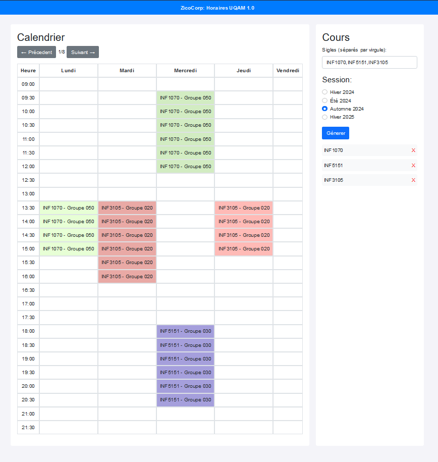

# UQAM Course Scheduler

This project is a website that uses optimization techniques, including backtracking, to generate schedules based on courses entered by the user for UQAM. The site provides all possible schedule combinations for the given list of courses. The project is built with HTML/CSS/JS/Bootstrap for the user interface and Python/Flask for the backend. It also includes scrapers to automatically update information on new courses, schedules, and other data.

## Features

- Generates all possible schedule combinations.
- Simple and intuitive interface for entering courses.
- Automatic data updates via scrapers.
